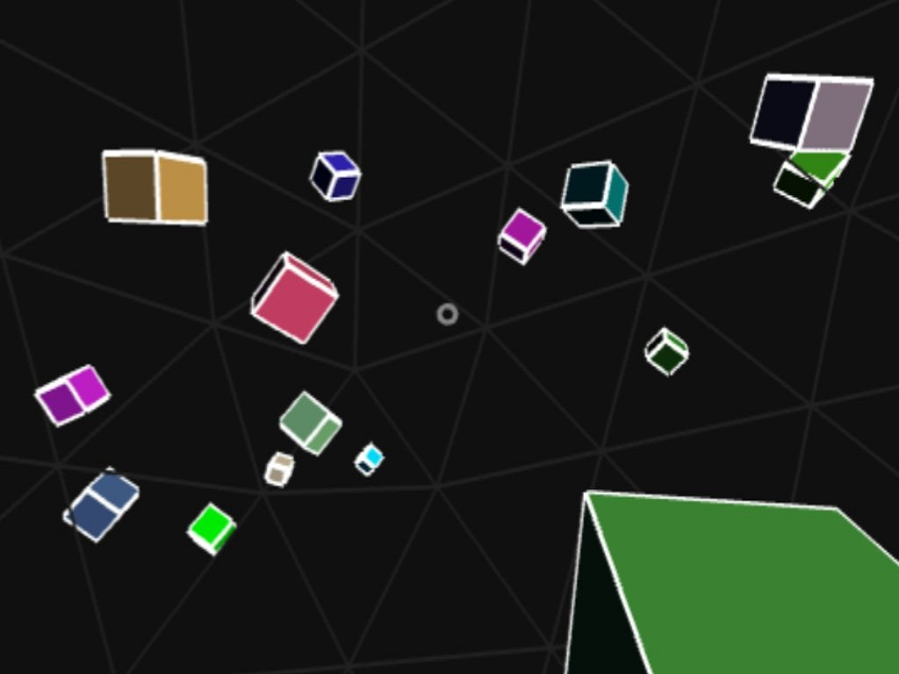

## Cube Fighter - A WebVR Game
Your mission: destroy all the cubes, armed with nothing but your mighty gaze cursor. Currently only one level, but position of cubes is randomly generated if you want to replay. AFAIK this is the World's First WebVR Game that runs on the Samsung Internet browser on Gear VR!

**Play Online**: https://amberroy.github.io/cube-fighter/

How to run WebVR apps on Gear VR:

1. Visit URL on your phone with Samsung Internet browser (from Google Play Store)
2. Place phone in your Gear VR to launch Samsung Internet (from Oculus Home Store)
    - one-time setup: visit internet://webvr-enable
3. Select the Enter VR button on web page and enjoy!  []-)

Attributions: Based on [a-invaders](https://github.com/dmarcos/a-invaders) by dmarcos and Three.js [webvr_cubes.html](https://github.com/mrdoob/three.js/blob/r75/examples/webvr_cubes.html) by mrdoob. Sound effects from Freesound: [164103](https://www.freesound.org/people/BMacZero/sounds/164103/) [269198](https://www.freesound.org/people/mickleness/sounds/269198/).

